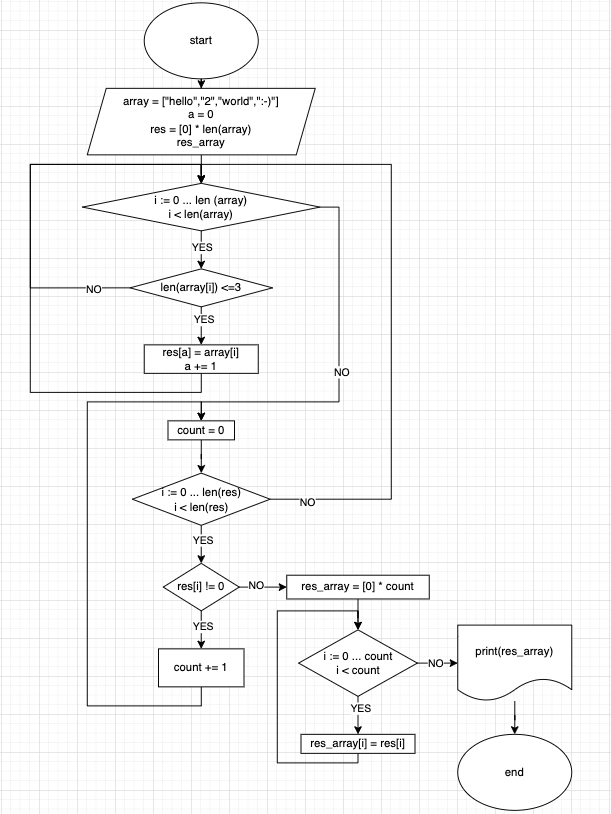
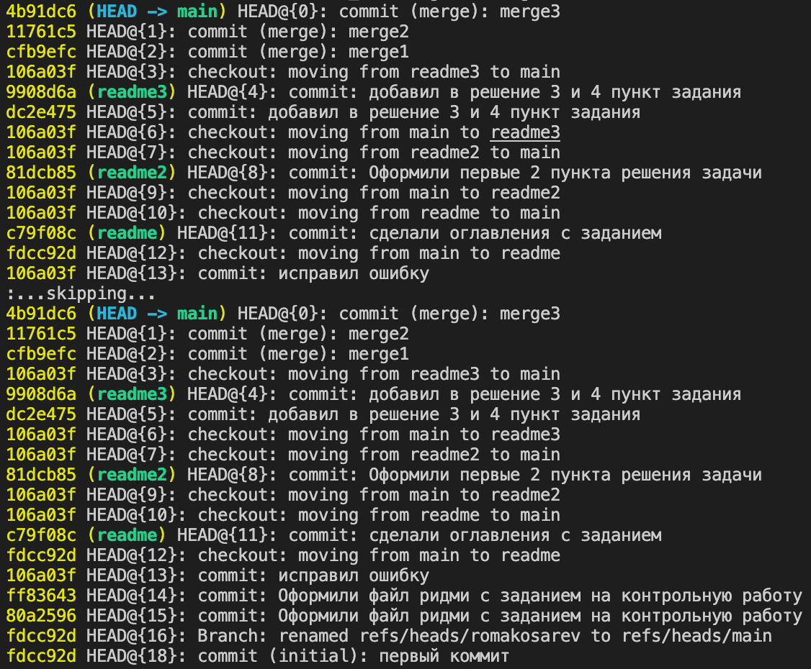

# Контрольная работа. Косарев Роман. #

## Задание: ##

1. Создать репозиторий на GitHub.

2. Нарисовать блок-схему алгоритма (можно обойтись блок-схемой основной содержательной части, если вы выделяете её в отдельный метод)

3. Снабдить репозиторий оформленным текстовым описанием решения (файл README.md)

4. Написать программу, решающую поставленную задачу

5. Использовать контроль версий в работе над этим небольшим проектом (не должно быть так что все залито одним коммитом, как минимум этапы 2, 3 и 4 должны быть расположены в разных коммитах)

**Текст задачи:**

*Написать программу, которая из имеющегося массива строк формирует массив из строк, длина которых меньше либо равна 3 символа. Первоначальный массив можно ввести с клавиатуры, либо задать на старте выполнения алгоритма. При решении не рекомендуется пользоваться коллекциями, лучше обойтись исключительно массивами.*

**Пример:**

["hello", "2", "world", ":-)"] -> ["2", ":-)"]

["1234", "1567", "-2", "computer science"] -> ["-2"]

["Russia", "Denmark", "Kazan"] -> []

=======
## Решение: ##

1. Ссылка на репозиторий: https://github.com/romakosarev/VERIFICATION_WORK
2. Блок схема алгоритма: 

=======
## Решение: ##

1. 
2. 
3. ### Описание решения: ###
Создаем дополнительный массив **res**, длинна должна совпадать с массивом **array**, но по умолчанию равен нулю. Далее в массив добавляем элементы, по условию задачи у которых длинна массива равна **3**. В полученном массиве считаем кол-во ненулевых элементов. Создаем массив длинна которого равна количеству ненуллевых значений в массиве **res.**

4. Cкрин по использованию контроля версий:

